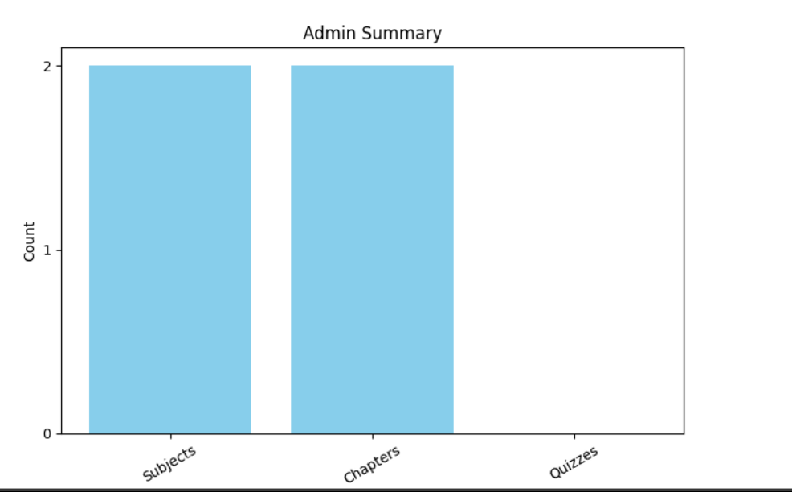

<h1><i>Quiz Master Web Application</i></h1> 

In this web app Admin can create Subjects, Chapters and quiz where users can give quizzes in a specific time period and they also get review for that wheather they are wrong or right. Users and admin also get summary chart of all the stuff
 
<b>Flask</b>:- 
Python Framework for backend
 
<b>Flask-SQLALchemy</b>:- 
For Database and ORM related 
 
<b>Flask-bcrypt</b>:- 
For password to convert in hash form
 
<b>Flask-login</b>:- 
For Login use
 
<b>Matplotlib</b>:- 
For visualization of Histogram and charts 
 
<b>HTML & CSS</b>:- 
For fortend and style
 
<b>In this Project i'm using jinja2 template which easy to use python in html file </b>

<h4>Steps To Install this web app in your Local System</h4> 

<h5>Create Virtual environment</h5> 
<pre>python -m venv venv </pre> 

<b>Activate Vitual Environment </b>

For Windows

<pre>venv/Scripts/activate</pre>

For Linux & Mac 

<pre>Source venv/Scripts/activate</pre>

<b>To install all required packages</b>
<pre>pip install -r requirements.txt</pre>

<b>To see which packages installed</b>
<pre>pip freeze</pre>

<b>To run our application</b>
<pre>python run.py</pre>

 
 
 
 
 

